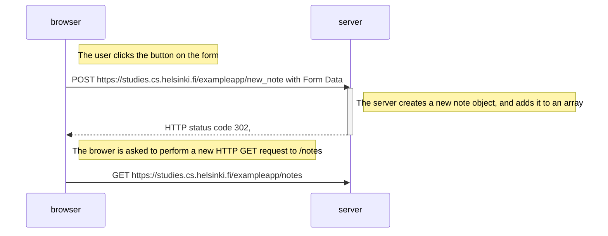

```mermaid
sequenceDiagram
    participant browser
    participant server

    Note right of browser: The user clicks the button on the form
    browser->>server: POST https://studies.cs.helsinki.fi/exampleapp/new_note with Form Data
    activate server
    Note right of server: The server creates a new note object, and adds it to an array
    server-->>browser: HTTP status code 302, 
    deactivate server

    Note right of browser: The brower is asked to perform a new HTTP GET request to /notes

    browser->>server: GET https://studies.cs.helsinki.fi/exampleapp/notes
```
