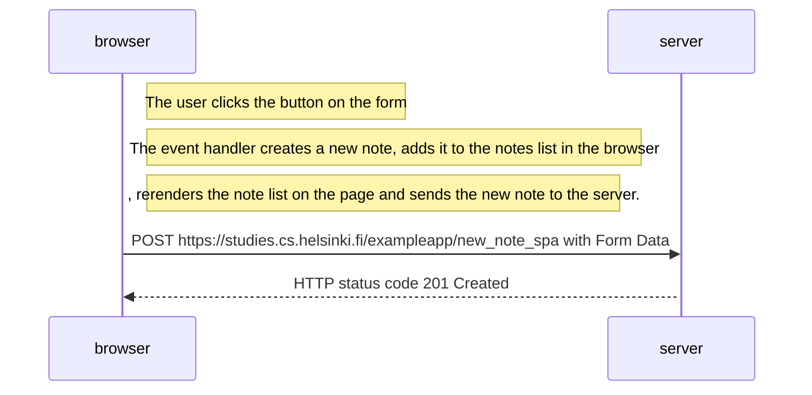

```mermaid
sequenceDiagram
    participant browser
    participant server

    Note right of browser: The user clicks the button on the form

    Note right of browser: The event handler creates a new note, adds it to the notes list in the browser

    Note right of browser: , rerenders the note list on the page and sends the new note to the server.

    browser->>server: POST https://studies.cs.helsinki.fi/exampleapp/new_note_spa with Form Data
    activate server
    server-->>browser: HTTP status code 201 Created
```
